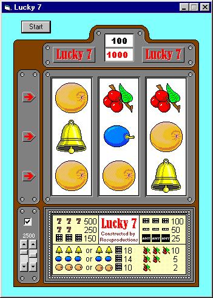



## slotmachine

### Description

Simple slotmachine

I made this slotmachine about 5 years ago, nothing fancy no directX only bitbld api. I didn't know anything about graphics so they were all done in paint. I got bored by the ones I found here so I uploaded this old thing. Hope you like it. (I know this could be better by using DirectX, I simply don't have the time doing that. I translated the comments from Dutch so there could be some errors there...) If you have a slow computer (a 486 when I made this thing) you'll have to change the values a bit to get it working properly (faster).
 
### More Info
 

             |
---                |---
**Submitted On**   |2001-05-13 12:20:52
**By**             |[Marc](https://github.com/Planet-Source-Code/PSCIndex/blob/master/ByAuthor/marc.md)
**Level**          |Intermediate
**User Rating**    |5.0 (15 globes from 3 users)
**Compatibility**  |VB 4\.0 \(32\-bit\), VB 5\.0, VB 6\.0
**Category**       |[Graphics](https://github.com/Planet-Source-Code/PSCIndex/blob/master/ByCategory/graphics__1-46.md)
**World**          |[Visual Basic](https://github.com/Planet-Source-Code/PSCIndex/blob/master/ByWorld/visual-basic.md)
**Archive File**   |[slotmachin195765132001\.zip](https://github.com/Planet-Source-Code/marc-slotmachine__1-23156/archive/master.zip)

